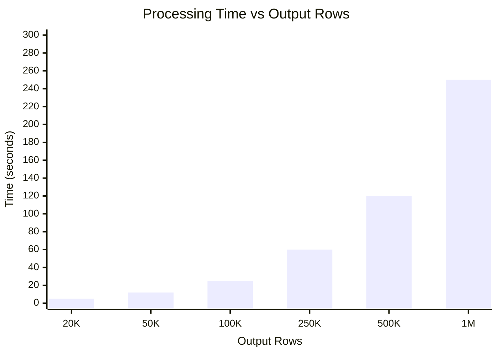
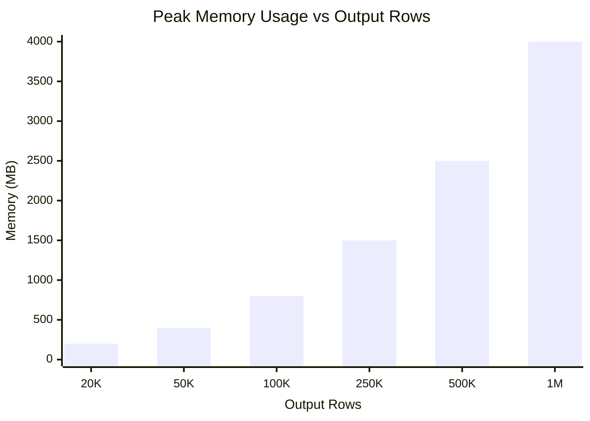
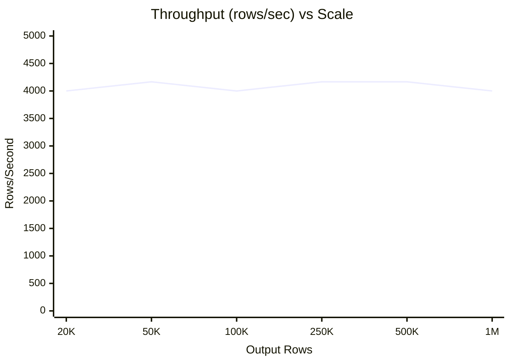

# OCP-Only Benchmark Plan

**Date**: November 26, 2025
**Status**: ✅ **EXECUTED**
**Purpose**: Measure processing time and memory for OCP-only aggregation at production scale
**Results**: See [OCP_BENCHMARK_RESULTS.md](OCP_BENCHMARK_RESULTS.md)
**Note**: Scale names refer to INPUT ROWS (hourly data from nise)

## Table of Contents

1. [Objectives](#-objectives)
2. [Benchmark Data Points](#-benchmark-data-points)
3. [Methodology](#-methodology)
4. [Expected Results](#-expected-results)
5. [Running Benchmarks](#-running-benchmarks)
6. [Correctness Validation](#-correctness-validation)
7. [Failure Recovery](#-failure-recovery)

---

## 🎯 Objectives

1. **Measure processing performance** at 8 scale points: 20K, 50K, 100K, 250K, 500K, 1M, 1.5M, 2M input rows
2. **Capture time and memory** for data processing + PostgreSQL insertion (NOT data generation)
3. **Generate reproducible benchmark results** with chart visualizations
4. **Validate memory stays within production limits** (target: < 32 GB)

---

## 📊 Benchmark Data Points

### Target Input Rows (Hourly Data from Nise)

Scale names refer to **INPUT ROWS** (hourly pod usage data before aggregation).

| Scale ID | Target Input Rows | Tolerance (±1%) | Pods | Nodes | Pods/Node | Hours |
|----------|-------------------|-----------------|------|-------|-----------|-------|
| **scale-20k** | 19,920 | 19,721 - 20,119 | 830 | 10 | 83 | 24 |
| **scale-50k** | 49,920 | 49,421 - 50,419 | 2,080 | 20 | 104 | 24 |
| **scale-100k** | 99,840 | 98,842 - 100,838 | 4,160 | 40 | 104 | 24 |
| **scale-250k** | 249,600 | 247,104 - 252,096 | 10,400 | 100 | 104 | 24 |
| **scale-500k** | 499,200 | 494,208 - 504,192 | 20,800 | 200 | 104 | 24 |
| **scale-1m** | 998,400 | 988,416 - 1,008,384 | 41,600 | 400 | 104 | 24 |
| **scale-1.5m** | 1,497,600 | 1,482,624 - 1,512,576 | 62,400 | 600 | 104 | 24 |
| **scale-2m** | 1,996,800 | 1,976,832 - 2,016,768 | 83,200 | 800 | 104 | 24 |

### Scale Interpretation (Real-World Equivalents)

What does each scale represent in a production environment?

| Scale | Input Rows | Cluster Size | Use Case Example |
|-------|------------|--------------|------------------|
| **20k** | ~20,000 | 10 nodes, ~830 pods | Small production cluster |
| **50k** | ~50,000 | 20 nodes, ~2,080 pods | Medium production environment |
| **100k** | ~100,000 | 40 nodes, ~4,160 pods | Large enterprise deployment |
| **250k** | ~250,000 | 100 nodes, ~10,400 pods | Multi-cluster enterprise |
| **500k** | ~500,000 | 200 nodes, ~20,800 pods | Very large enterprise |
| **1m** | ~1,000,000 | 400 nodes, ~41,600 pods | Hyperscale platform |
| **1.5m** | ~1,500,000 | 600 nodes, ~62,400 pods | Major cloud provider scale |
| **2m** | ~2,000,000 | 800 nodes, ~83,200 pods | Maximum tested scale |

**Note**: Scale names refer to hourly input rows from nise (pods × 24 hours).

### Input/Output Row Formula

```
Input Rows = Pods × 24 hours (hourly data from nise)
Output Rows = Daily aggregated summaries (much smaller)

Example for scale-20k:
  - 830 pods × 24 hours = 19,920 input rows ✓
  - Output rows = aggregated by namespace/node/day
```

**Key Constraints**:
- Scale names refer to INPUT rows (hourly data)
- Tolerance: ±1% of target input row count is acceptable
- 24-hour period (single day) for consistent hourly granularity

---

## 🔧 Processing Mode

### IN-MEMORY Processing

- Load all parquet files into memory at once
- Aggregate pod and storage usage in-memory
- Write results to PostgreSQL

```yaml
streaming:
  enabled: false
```

### Why Not Streaming?

Streaming mode was evaluated but **not adopted** for the following reasons:

| Factor | Impact | Assessment |
|--------|--------|------------|
| **Processing time** | +100-200% increase | ❌ Significant overhead |
| **Memory savings** | ~20-30% decrease | ⚠️ Marginal benefit |
| **OCP-on-AWS compatibility** | Cannot benefit | ❌ JOIN requires full AWS data in memory |
| **Code complexity** | Additional paths to maintain | ❌ Maintenance burden |

**Key insight**: OCP-on-AWS has an inherent memory floor because the AWS data must be fully loaded for JOIN operations. Streaming only chunks the OCP side, providing minimal memory benefit while adding significant processing overhead.

**Future consideration**: The same constraint applies to all upcoming cloud integrations:
- OCP-on-Azure
- OCP-on-GCP
- OCP-on-{other cloud providers}

All require JOIN operations between OCP data and cloud billing data, making streaming ineffective for the most memory-intensive scenarios.

**Decision**: For consistency across OCP-only and all OCP-on-{cloud} scenarios, we use **in-memory processing only**. This simplifies the codebase and avoids confusion about when streaming would be beneficial (answer: never in practice).

> ⚠️ **Note**: Streaming code may be removed from the codebase if the team decides it adds unnecessary complexity.

---

## 📐 Measurement Metrics

### Primary Metrics

| Metric | Unit | Description |
|--------|------|-------------|
| **Processing Time** | seconds | Time from data loading to PostgreSQL commit |
| **Peak Memory** | MB | Maximum RSS memory during processing (sampled continuously) |
| **Throughput** | rows/sec | Output rows produced per second |
| **Memory Efficiency** | KB/row | Memory used per output row |

### Secondary Metrics (Step Breakdown)

| Step | Metric Name | Description |
|------|-------------|-------------|
| **Step 1** | `ocp_load_time` | Time to load OCP parquet from MinIO |
| **Step 2** | `capacity_time` | Time for node capacity calculation |
| **Step 3** | `pod_aggregation_time` | Time for pod usage aggregation |
| **Step 4** | `storage_aggregation_time` | Time for storage usage aggregation |
| **Step 5** | `format_time` | Time for output formatting |
| **Step 6** | `db_write_time` | Time for PostgreSQL COPY |
| **Total** | `total_time` | End-to-end processing time |

### Statistical Requirements (Industry Standard)

| Requirement | Value | Rationale |
|-------------|-------|-----------|
| **Minimum runs per scale** | 3 | Reduce variance from system noise |
| **Reported value** | Median | Robust to outliers |
| **Variance measure** | Standard deviation | Quantify reproducibility |
| **Outlier handling** | Report but exclude from median | Document anomalies |

---

## 🖥️ Benchmark Environment

### Hardware (MacBook - Consistent with OCP-on-AWS benchmarks)

| Component | Specification |
|-----------|---------------|
| **Machine** | MacBook Pro |
| **CPU** | Apple M2 Max |
| **Cores** | 12 cores |
| **Memory** | 32 GB RAM |
| **Storage** | 1 TB SSD |

### Software Versions (Document Before Running)

| Component | Version | Command to Check |
|-----------|---------|------------------|
| **Python** | 3.x.x | `python --version` |
| **pandas** | x.x.x | `pip show pandas \| grep Version` |
| **PyArrow** | x.x.x | `pip show pyarrow \| grep Version` |
| **psycopg2** | x.x.x | `pip show psycopg2-binary \| grep Version` |
| **nise** | x.x.x | `pip show nise \| grep Version` |
| **PostgreSQL** | 15.x | `psql --version` |

### Disk Space Requirements

| Scale | CSV Size (est.) | Parquet Size (est.) | Working Space | Recommended Free |
|-------|-----------------|---------------------|---------------|------------------|
| 20k | ~50 MB | ~10 MB | ~100 MB | 500 MB |
| 50k | ~125 MB | ~25 MB | ~250 MB | 1 GB |
| 100k | ~250 MB | ~50 MB | ~500 MB | 2 GB |
| 250k | ~625 MB | ~125 MB | ~1.25 GB | 3 GB |
| 500k | ~1.25 GB | ~250 MB | ~2.5 GB | 5 GB |
| 1m | ~2.5 GB | ~500 MB | ~5 GB | 10 GB |

### PostgreSQL Configuration (docker-compose)

```yaml
# docker-compose.yml - benchmark-optimized settings
services:
  postgres:
    image: postgres:15
    environment:
      POSTGRES_DB: koku
      POSTGRES_USER: koku
      POSTGRES_PASSWORD: koku
    command:
      - "postgres"
      - "-c"
      - "shared_buffers=512MB"
      - "-c"
      - "work_mem=64MB"
      - "-c"
      - "maintenance_work_mem=256MB"
      - "-c"
      - "effective_cache_size=1GB"
      - "-c"
      - "synchronous_commit=off"
    ports:
      - "5432:5432"
```

### MinIO Configuration

```yaml
# docker-compose.yml
services:
  minio:
    image: minio/minio
    command: server /data --console-address ":9001"
    ports:
      - "9000:9000"
      - "9001:9001"
```

---

## 🔬 Benchmark Methodology

### Pre-flight Checklist

Before running benchmarks:

- [ ] No other CPU-intensive processes running (`top` / Activity Monitor)
- [ ] Docker/Podman containers restarted fresh
- [ ] Disk has ≥10 GB free space (`df -h`)
- [ ] Previous benchmark data cleaned up (`rm -rf /tmp/ocp-benchmark-*`)
- [ ] Virtual environment activated (`source venv/bin/activate`)
- [ ] MinIO is running and accessible
- [ ] PostgreSQL is running and accessible
- [ ] Software versions documented

### Top-Level Stage Breakdown

Each benchmark run captures **time and memory** for three distinct stages:

| Stage | Description | Runs Per Scale | Measured |
|-------|-------------|----------------|----------|
| **Stage 1: Nise Generation** | Generate synthetic OCP CSV data using nise | **Once** | Time (reported separately) |
| **Stage 2: Parquet Transform** | Convert CSV to Parquet and upload to MinIO | **Once** | Time (reported separately) |
| **Stage 3: Aggregation** | Run POC aggregation pipeline (in-memory) | **3 times** | Time + Memory |

### What We Measure (Stage 3 - Aggregation)

```
START TIMING + MEMORY SAMPLING (100ms interval)
├── Load OCP parquet files from MinIO
├── Calculate node capacity
├── Aggregate pod usage (CPU, memory, labels)
├── Aggregate storage usage (PVC, PV)
├── Output formatting
└── PostgreSQL bulk COPY insert
END TIMING + MEMORY SAMPLING
```

### Memory Measurement (Industry Standard)

```python
# Continuous sampling during execution (not before/after)
import threading
import psutil
import time

peak_memory_mb = [0]
done = [False]

def memory_monitor():
    process = psutil.Process()
    while not done[0]:
        current = process.memory_info().rss / 1024 / 1024
        peak_memory_mb[0] = max(peak_memory_mb[0], current)
        time.sleep(0.1)  # Sample every 100ms

monitor_thread = threading.Thread(target=memory_monitor)
monitor_thread.start()

# Run aggregation
main()

done[0] = True
monitor_thread.join()
# peak_memory_mb[0] now contains true peak
```

### What We Do NOT Measure (in primary results)

- ❌ CSV generation (nise) - reported separately as "data prep time"
- ❌ CSV to Parquet conversion - reported separately as "data prep time"
- ❌ PostgreSQL schema creation (one-time setup)

### 🎯 Memory Target

| Metric | Value | Notes |
|--------|-------|-------|
| **Production VM** | 32 GB | Target production environment |
| **Target: Stay under** | 32 GB | No infra changes needed |
| **Expected at 2M input rows** | ~8 GB | Based on actual benchmarks |
| **Projected max input rows** | ~8M+ rows | Before hitting 32 GB limit |

**Success Criteria**: If 2M input rows can be processed with < 32 GB memory, in-memory processing is sufficient.

### Warmup Protocol

Before each benchmark run:
1. **Cold start elimination**: Run one iteration (discarded) to warm up:
   - MinIO/S3 connections
   - PostgreSQL connection pool
   - Python JIT compilation
2. **Measured runs**: Next 3 iterations are recorded
3. **Report**: Median of 3 runs ± standard deviation

---

## ✅ Correctness Validation

After each benchmark scale, verify results:

| Check | Method | Pass Criteria |
|-------|--------|---------------|
| **Row count** | `SELECT COUNT(*)` | Within ±1% of target |
| **No NULLs in required columns** | `SELECT COUNT(*) WHERE col IS NULL` | 0 rows |
| **Date range correct** | `SELECT DISTINCT usage_start` | 24 hourly rows |
| **Spot check** | Compare 3 random rows | Values match expected |

```sql
-- Validation queries
SELECT COUNT(*) FROM org1234567.reporting_ocpusagelineitem_daily_summary;
SELECT COUNT(*) FROM org1234567.reporting_ocpusagelineitem_daily_summary
  WHERE pod IS NULL OR namespace IS NULL;
SELECT DISTINCT DATE(usage_start) FROM org1234567.reporting_ocpusagelineitem_daily_summary;
```

---

## 📈 Expected Results

### Processing Time vs Output Rows



**Expected Pattern**: Linear scaling with data size

---

### Memory Usage vs Output Rows



**Expected Pattern**: Linear memory growth with data size

---

### Throughput



**Expected Pattern**: Consistent throughput ~4000 rows/sec

---

## 📋 Results Table Template

### Summary Results (Median ± StdDev from 3 runs)

| Scale | Input Rows | Time (s) | Time StdDev | Memory (MB) | Memory StdDev | Throughput |
|-------|------------|----------|-------------|-------------|---------------|------------|
| scale-20k | ~19,920 | ___ | ±___ | ___ | ±___ | ___ rows/s |
| scale-50k | ~49,920 | ___ | ±___ | ___ | ±___ | ___ rows/s |
| scale-100k | ~99,840 | ___ | ±___ | ___ | ±___ | ___ rows/s |
| scale-250k | ~249,600 | ___ | ±___ | ___ | ±___ | ___ rows/s |
| scale-500k | ~499,200 | ___ | ±___ | ___ | ±___ | ___ rows/s |
| scale-1m | ~998,400 | ___ | ±___ | ___ | ±___ | ___ rows/s |
| scale-1.5m | ~1,497,600 | ___ | ±___ | ___ | ±___ | ___ rows/s |
| scale-2m | ~1,996,800 | ___ | ±___ | ___ | ±___ | ___ rows/s |

### Memory Efficiency

| Scale | Input Rows | Memory (MB) | KB/row |
|-------|------------|-------------|--------|
| scale-20k | ~19,920 | ___ | ___ |
| scale-50k | ~49,920 | ___ | ___ |
| scale-100k | ~99,840 | ___ | ___ |
| scale-250k | ~249,600 | ___ | ___ |
| scale-500k | ~499,200 | ___ | ___ |
| scale-1m | ~998,400 | ___ | ___ |
| scale-1.5m | ~1,497,600 | ___ | ___ |
| scale-2m | ~1,996,800 | ___ | ___ |

---

## 🔧 Test Data Generation

### Existing Manifests

Manifests already exist in `test-manifests/ocp-benchmarks/`:

| Scale | Manifest | Nodes | Pods/Node | Total Pods | Input Rows |
|-------|----------|-------|-----------|------------|------------|
| 20k | `benchmark_ocp_20k.yml` | 10 | 83 | 830 | ~19,920 |
| 50k | `benchmark_ocp_50k.yml` | 20 | 104 | 2,080 | ~49,920 |
| 100k | `benchmark_ocp_100k.yml` | 40 | 104 | 4,160 | ~99,840 |
| 250k | `benchmark_ocp_250k.yml` | 100 | 104 | 10,400 | ~249,600 |
| 500k | `benchmark_ocp_500k.yml` | 200 | 104 | 20,800 | ~499,200 |
| 1m | `benchmark_ocp_1m.yml` | 400 | 104 | 41,600 | ~998,400 |
| 1.5m | `benchmark_ocp_1.5m.yml` | 600 | 104 | 62,400 | ~1,497,600 |
| 2m | `benchmark_ocp_2m.yml` | 800 | 104 | 83,200 | ~1,996,800 |

### Pre-generated Data Location

```
nise_benchmark_data/ocp-benchmarks/
├── scale-20k/
│   └── ocp/           # Pre-generated OCP parquet
├── scale-50k/
├── scale-100k/
├── scale-250k/
├── scale-500k/
├── scale-1m/
├── scale-1.5m/
└── scale-2m/
```

---

## 🚀 Execution Plan

### Phase 1: Data Preparation

1. ✅ Manifests already created (6 manifests in `test-manifests/ocp-benchmarks/`)
2. Generate test data (CSV) using nise - run once per scale
3. Convert to Parquet and upload to MinIO
4. Validate row counts are within ±1% tolerance

### Phase 2: Benchmark Execution

#### Automated Script (Unattended Run)

```bash
# Run all 6 benchmarks (3 runs each = 18 total runs)
./scripts/run_ocp_full_benchmarks.sh

# Run specific scale
./scripts/run_ocp_full_benchmarks.sh 100k
```

#### Manual Execution (Single Run)

```bash
# Activate environment
source venv/bin/activate

# Run via main entry point
python -c "from src.main import main; main()"
```

#### Metrics Captured Per Run

| Metric | Source | Unit |
|--------|--------|------|
| `total_time` | POC logs | seconds |
| `peak_memory` | Continuous sampling (100ms) | MB |
| `output_rows` | PostgreSQL query | count |
| `ocp_input_rows` | POC logs | count |
| `phase_timings` | POC logs (PerformanceTimer) | seconds |

### Phase 3: Analysis

1. Compile results into summary table (Markdown)
2. Calculate median and standard deviation for each scale
3. Generate Mermaid charts (update results document)
4. Calculate derived metrics:
   - Throughput: `output_rows / total_time`
   - Memory efficiency: `peak_memory / output_rows`
5. Compare with OCP-on-AWS results

---

## 🔥 Failure Recovery

### If a Benchmark Fails

1. **Check logs**:
   ```bash
   ls -la $BENCHMARK_DIR/${SCALE}_*.log
   tail -50 $BENCHMARK_DIR/${SCALE}_agg.log
   ```

2. **Verify infrastructure**:
   ```bash
   curl -s http://localhost:9000/minio/health/live
   podman exec postgres-poc psql -U koku -d koku -c "SELECT 1"
   ```

3. **Clean up**:
   ```bash
   rm -rf /tmp/ocp-benchmark-*
   ```

4. **Re-run single scale**:
   ```bash
   ./scripts/run_ocp_full_benchmarks.sh ${SCALE}
   ```

### Common Failure Modes

| Symptom | Likely Cause | Fix |
|---------|--------------|-----|
| "MinIO not running" | Container stopped | `podman-compose up -d` |
| "PostgreSQL not running" | Container stopped | `podman-compose up -d` |
| OOM during nise | Disk full | Free disk space |
| Slow performance | Background processes | Kill other apps, restart containers |

---

## 📊 Comparison with OCP-on-AWS

### Expected Differences

| Metric | OCP-Only | OCP-on-AWS | Reason |
|--------|----------|------------|--------|
| **Time** | Baseline | +30-50% | AWS matching + JOIN overhead |
| **Memory** | Baseline | +20-40% | AWS data must be in memory |
| **Throughput** | Higher | Lower | No JOIN processing |

---

## 📁 Deliverables

1. **`OCP_BENCHMARK_RESULTS.md`** - Complete results with Mermaid charts (update existing)
2. **`benchmark_results/ocp_<timestamp>/`** - Raw logs and metrics
3. **`benchmark_results/ocp_<timestamp>/RESULTS.csv`** - Machine-readable results
4. **Updated `UNIFIED_PERFORMANCE_ANALYSIS.md`** - Comparison with OCP-on-AWS

---

## 📅 Timeline

| Phase | Task | Duration |
|-------|------|----------|
| 1 | Pre-flight checklist + validate manifests | 30 min |
| 2 | Generate and prepare test data (6 scales) | 3 hours |
| 3 | Run benchmarks (6 scales × 3 runs = 18 runs) | 3 hours |
| 4 | Analyze results and generate report | 1 hour |
| **Total** | | **~7.5 hours** |

---

## 🎯 Success Criteria

- [ ] Pre-flight checklist completed
- [ ] Software versions documented
- [ ] All 24 benchmark runs complete without errors (8 scales × 3 runs)
- [ ] Results captured with median ± stddev
- [ ] Correctness validation passed for all scales
- [ ] Memory stays within 32 GB limit
- [ ] Charts generated showing scaling behavior
- [ ] Clear comparison with OCP-on-AWS overhead documented

---

**Status**: Ready for execution
