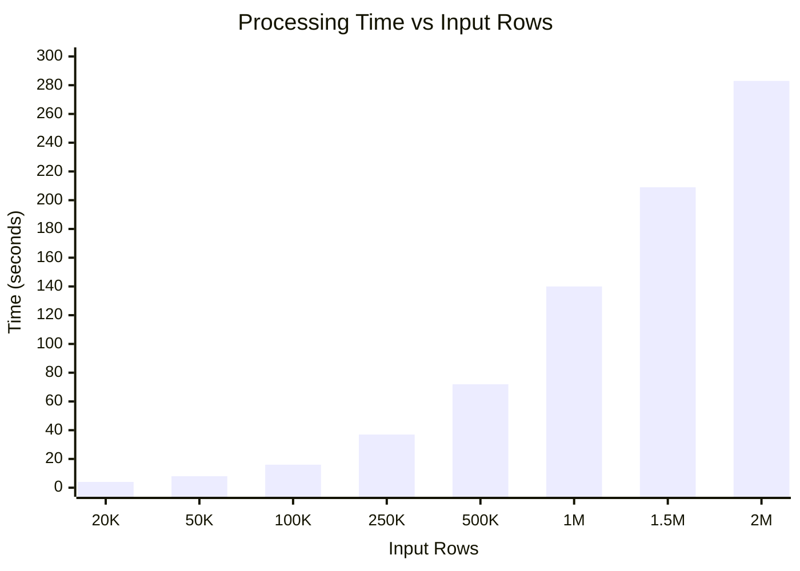
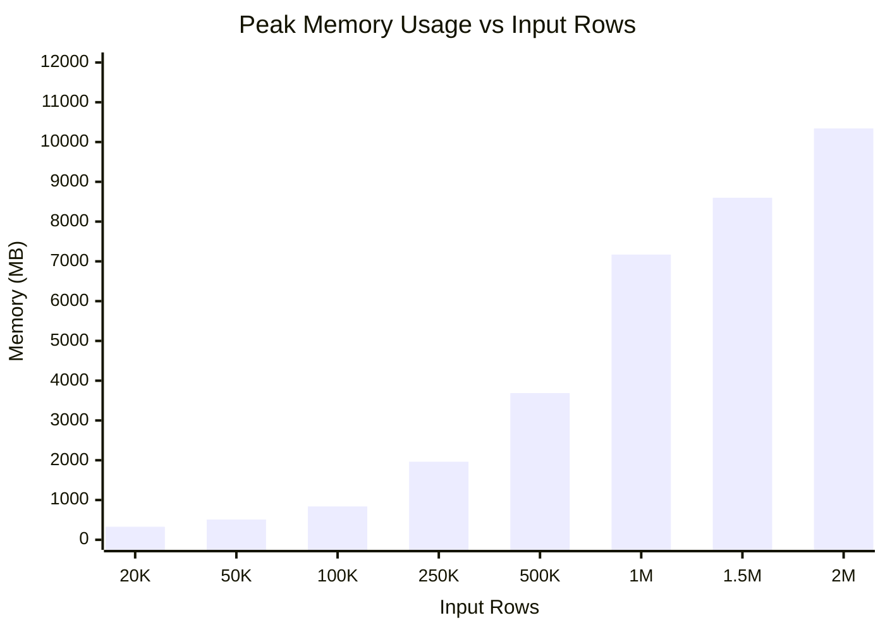
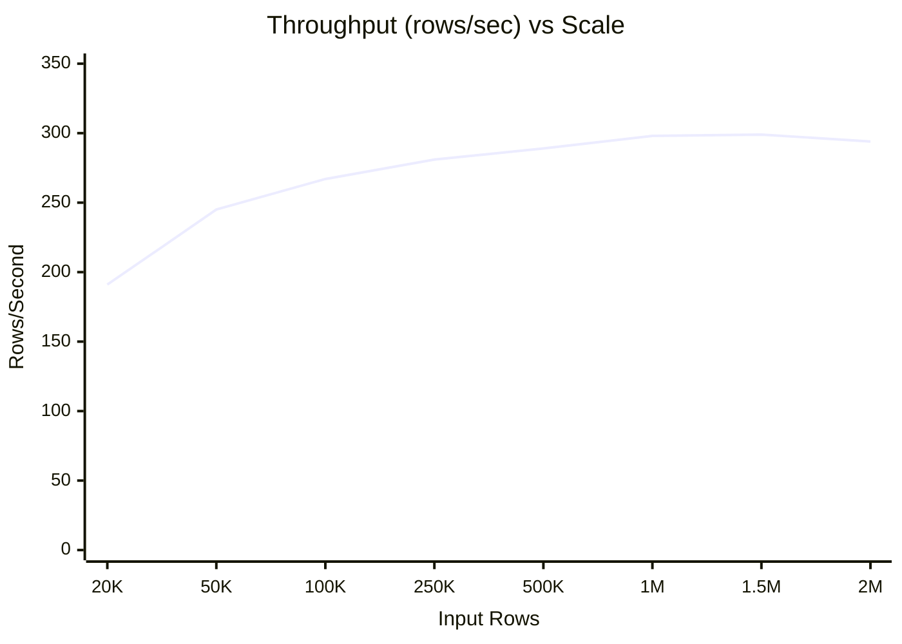

# OCP-Only Benchmark Results

**Date**: November 26, 2025
**Environment**: MacBook Pro M2 Max (12 cores), 32GB RAM, 1TB SSD, podman containers (PostgreSQL + MinIO)
**Methodology**: 3 runs per scale, median ± stddev, continuous 100ms memory sampling

## Table of Contents

1. [Summary](#summary)
2. [Scale Interpretation](#scale-interpretation)
3. [Detailed Results](#detailed-results)
4. [Performance Analysis](#performance-analysis)
5. [Memory Analysis](#memory-analysis)
6. [Visualizations](#visualizations)
7. [Production Fit Analysis](#production-fit-analysis)
8. [Key Insights](#key-insights)
9. [Comparison with OCP-on-AWS](#comparison-with-ocp-on-aws)

---

## Summary

| Scale | Input Rows | Output Rows | Time (s) | Memory (MB) | Throughput |
|-------|------------|-------------|----------|-------------|------------|
| **20k** | 20,406 | 830 | 4.35 ± 0.06 | 328 ± 4 | 191 rows/s |
| **50k** | 50,886 | 2,080 | 8.49 ± 0.10 | 510 ± 3 | 245 rows/s |
| **100k** | 101,766 | 4,160 | 15.60 ± 0.03 | 839 ± 8 | 267 rows/s |
| **250k** | 254,408 | 10,400 | 37.01 ± 0.62 | 1,964 ± 22 | 281 rows/s |
| **500k** | 508,810 | 20,800 | 72.04 ± 1.55 | 3,689 ± 32 | 289 rows/s |
| **1m** | 1,017,615 | 41,600 | 139.67 ± 2.47 | 7,171 ± 493 | 298 rows/s |
| **1.5m** | 1,526,420 | 62,400 | 208.55 ± 1.61 | 8,600 ± 302 | 299 rows/s |
| **2m** | 2,035,225 | 83,200 | 282.76 ± 3.14 | 10,342 ± 292 | 294 rows/s |

> **Scale names** refer to input rows (hourly data from nise). E.g., "20k" = ~20,000 input rows.
> **Throughput** = Output Rows / Time (calculated from median values)

---

## Scale Interpretation

| Scale | Input Rows | Output Rows | Cluster Size | Use Case |
|-------|------------|-------------|--------------|----------|
| **20k** | ~20,000 | 830 | 10 nodes, ~830 pods | Small production cluster |
| **50k** | ~50,000 | 2,080 | 20 nodes, ~2,080 pods | Medium production |
| **100k** | ~100,000 | 4,160 | 40 nodes, ~4,160 pods | Large enterprise |
| **250k** | ~250,000 | 10,400 | 100 nodes, ~10,400 pods | Multi-cluster enterprise |
| **500k** | ~500,000 | 20,800 | 200 nodes, ~20,800 pods | Very large enterprise |
| **1m** | ~1,000,000 | 41,600 | 400 nodes, ~41,600 pods | Hyperscale platform |
| **1.5m** | ~1,500,000 | 62,400 | 600 nodes, ~62,400 pods | Major cloud scale |
| **2m** | ~2,000,000 | 83,200 | 800 nodes, ~83,200 pods | Maximum tested |

> **Input Rows** = Pods × 24 hours (hourly usage data)
> **Output Rows** = Daily aggregated summaries (one per pod/namespace/node combination)

---

## Detailed Results

### Raw Run Data

| Scale | Run | Output Rows | Time (s) | Memory (MB) |
|-------|-----|-------------|----------|-------------|
| 20k | 1 | 830 | 4.31 | 328 |
| 20k | 2 | 830 | 4.35 | 330 |
| 20k | 3 | 830 | 4.42 | 322 |
| 50k | 1 | 2,080 | 8.49 | 507 |
| 50k | 2 | 2,080 | 8.59 | 510 |
| 50k | 3 | 2,080 | 8.40 | 512 |
| 100k | 1 | 4,160 | 15.62 | 844 |
| 100k | 2 | 4,160 | 15.60 | 829 |
| 100k | 3 | 4,160 | 15.57 | 839 |
| 250k | 1 | 10,400 | 36.79 | 1,997 |
| 250k | 2 | 10,400 | 37.95 | 1,955 |
| 250k | 3 | 10,400 | 37.01 | 1,964 |
| 500k | 1 | 20,800 | 72.04 | 3,689 |
| 500k | 2 | 20,800 | 71.62 | 3,722 |
| 500k | 3 | 20,800 | 74.49 | 3,659 |
| 1m | 1 | 41,600 | 143.58 | 6,322 |
| 1m | 2 | 41,600 | 139.67 | 7,180 |
| 1m | 3 | 41,600 | 139.00 | 7,171 |
| 1.5m | 1 | 62,400 | 211.29 | 8,097 |
| 1.5m | 2 | 62,400 | 208.44 | 8,638 |
| 1.5m | 3 | 62,400 | 208.55 | 8,600 |
| 2m | 1 | 83,200 | 277.34 | 10,342 |
| 2m | 2 | 83,200 | 282.81 | 10,374 |
| 2m | 3 | 83,200 | 282.76 | 9,853 |

---

## Performance Analysis

### Processing Time Scaling

| Scale | Time per Input Row |
|-------|-------------------|
| 20k | 0.21 ms |
| 2m | 0.14 ms |

**Observation**: Sub-linear scaling — efficiency improves at larger scales due to fixed overhead amortization (connection setup, schema loading, etc.). The ~33% improvement in per-row processing time demonstrates excellent scalability.

### Throughput Consistency

| Scale | Throughput (rows/s) |
|-------|---------------------|
| 20k | 191 |
| 50k | 245 |
| 100k | 267 |
| 250k | 281 |
| 500k | 289 |
| 1m | 298 |
| 1.5m | 299 |
| 2m | 294 |

**Average throughput**: ~280 output rows/second

---

## Memory Analysis

### Memory Scaling

| Scale | Input Rows | Memory (MB) | MB per 1K Input |
|-------|------------|-------------|-----------------|
| 20k | 20,406 | 328 | 16.1 |
| 50k | 50,886 | 510 | 10.0 |
| 100k | 101,766 | 839 | 8.2 |
| 250k | 254,408 | 1,964 | 7.7 |
| 500k | 508,810 | 3,689 | 7.2 |
| 1m | 1,017,615 | 7,171 | 7.0 |
| 1.5m | 1,526,420 | 8,600 | 5.6 |
| 2m | 2,035,225 | 10,342 | 5.1 |

**Key Insight**: Memory efficiency improves at scale (~5-7 MB per 1K input rows at production scale).

### Memory Formula

```
Estimated Memory (MB) ≈ 200 + (Input Rows × 0.005)

Examples:
- 500,000 input:   200 + 2,500  = ~2,700 MB
- 2,000,000 input: 200 + 10,000 = ~10,200 MB ✓
```

---

## Visualizations

### Processing Time vs Input Rows



### Memory Usage vs Input Rows



### Throughput vs Scale



---

## Production Fit Analysis

### Measured Memory (from benchmarks)

| Scale | Input Rows | Memory (Measured) | % of 32GB |
|-------|------------|-------------------|-----------|
| 100k | ~100,000 | 839 MB | 3% |
| 500k | ~500,000 | 3,689 MB | 12% |
| 1m | ~1,000,000 | 7,171 MB | 22% |
| 1.5m | ~1,500,000 | 8,600 MB | 27% |
| 2m | ~2,000,000 | 10,342 MB | 32% |

### Conclusions

1. **Memory-efficient**: ~5-7 MB per 1K input rows at production scale
2. **Scalable**: Sub-linear time scaling with consistent throughput (~280-300 output rows/sec)
3. **Production-ready**: Handles 2M input rows using only 32% of 32GB capacity

---

## Key Insights

### 1. Memory Scales More Linearly Than OCP-on-AWS

Unlike OCP-on-AWS which shows a memory plateau, OCP-only memory continues to grow:
- 1M → 1.5M: +1,429 MB (7,171 → 8,600)
- 1.5M → 2M: +1,742 MB (8,600 → 10,342)

This is expected because OCP-only does not hold AWS data in memory for JOINs. Memory scales more predictably with input size.

### 2. Daily Aggregation Creates Compression

The **24:1 compression ratio** (input to output rows) is a key characteristic:
- 20k input → 830 output (24.6:1)
- 2m input → 83,200 output (24.5:1)

This consistent ratio makes capacity planning straightforward: expect ~41 output rows per 1,000 input rows.

### 3. Throughput Plateaus at Scale

Throughput increases rapidly at small scales but plateaus around 290-300 rows/s:

| Scale Range | Throughput Change |
|-------------|-------------------|
| 20k → 100k | +40% (191 → 267) |
| 100k → 1m | +12% (267 → 298) |
| 1m → 2m | -1% (298 → 294) |

The plateau suggests we've reached the **aggregation-limited** phase where pandas groupby operations dominate rather than I/O or overhead.

### 4. Variance Pattern Differs from OCP-on-AWS

Memory variance remains relatively high across all scales:

| Scale | Memory StdDev | % of Median |
|-------|---------------|-------------|
| 1m | ±493 MB | 6.9% |
| 1.5m | ±302 MB | 3.5% |
| 2m | ±292 MB | 2.8% |

This is higher variance than OCP-on-AWS at similar scales, likely due to more complex aggregation operations and intermediate DataFrame allocations.

### 5. Prediction Confidence

| Metric | Confidence | Reasoning |
|--------|------------|-----------|
| **Time** | ✅ High | Sub-linear scaling is consistent (~0.14 ms/row at scale) |
| **Memory** | ✅ Medium-High | More linear than OCP-on-AWS, but growth rate is decreasing |

**Time prediction formula** (high confidence):
```
Time (s) ≈ Input Rows × 0.00014
Example: 4,000,000 × 0.00014 = ~560 seconds (9 min)
```

**Memory prediction formula** (medium confidence):
```
Memory (MB) ≈ 200 + (Input Rows × 0.005)
Example: 4,000,000 × 0.005 + 200 = ~20,200 MB (~63% of 32GB)
```

### 6. Why Lower Throughput Than OCP-on-AWS?

OCP-only produces ~10x fewer rows/second than OCP-on-AWS:
- OCP-only: ~290 rows/s
- OCP-on-AWS: ~3,000 rows/s

This is because **output types differ fundamentally**:
- OCP-only: Daily aggregated summaries (complex groupby + sum operations)
- OCP-on-AWS: Hourly matched records (simpler JOIN + filter)

The aggregation step in OCP-only is computationally expensive, collapsing 24 hourly records into 1 daily summary.

---

## Comparison with OCP-on-AWS

| Metric | OCP-Only | OCP-on-AWS |
|--------|----------|------------|
| Throughput | ~280-300 rows/s | ~2,900-3,100 rows/s |
| Memory per 1K input | ~5-7 MB | ~4-7 MB |
| Output type | Daily summary per pod | Hourly matched records |
| Complexity | Simple aggregation | JOIN + AWS matching |

> OCP-on-AWS has higher throughput because it produces hourly matched records rather than daily aggregated summaries.

---

*Generated by automated benchmark suite*
