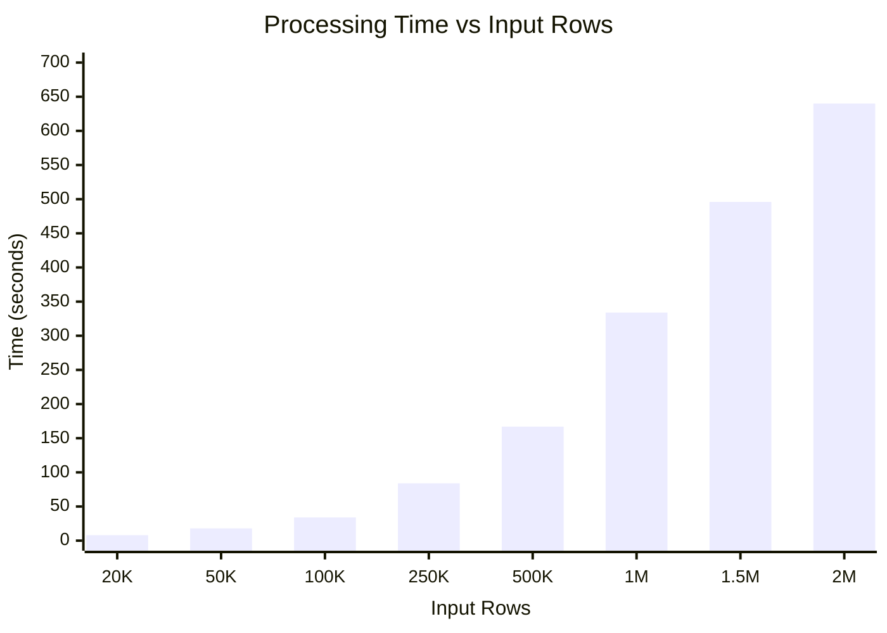
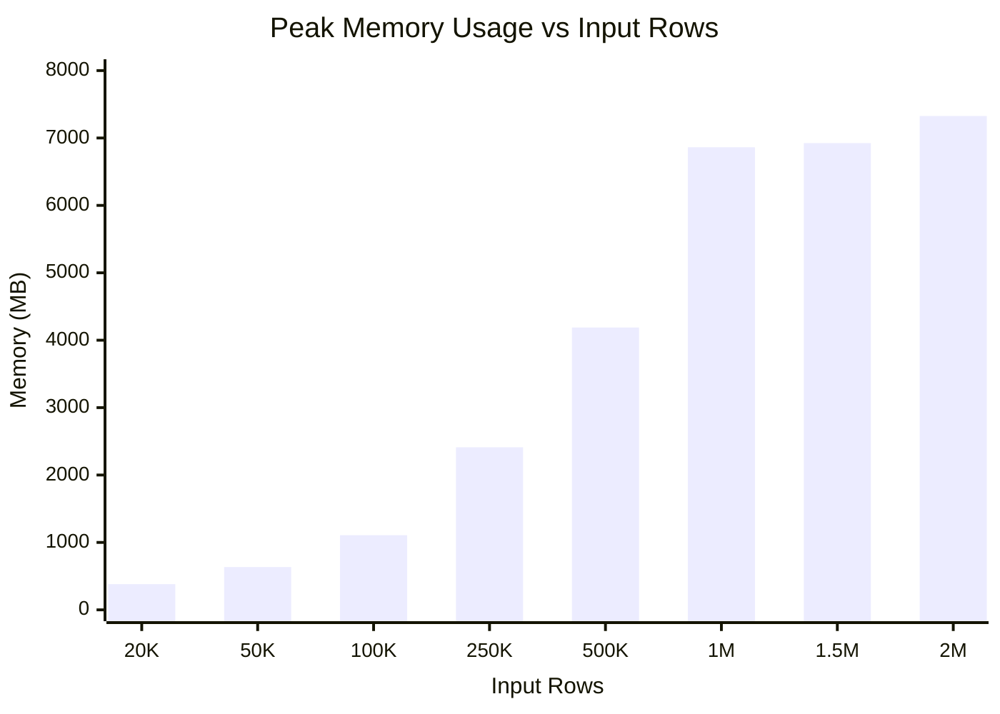
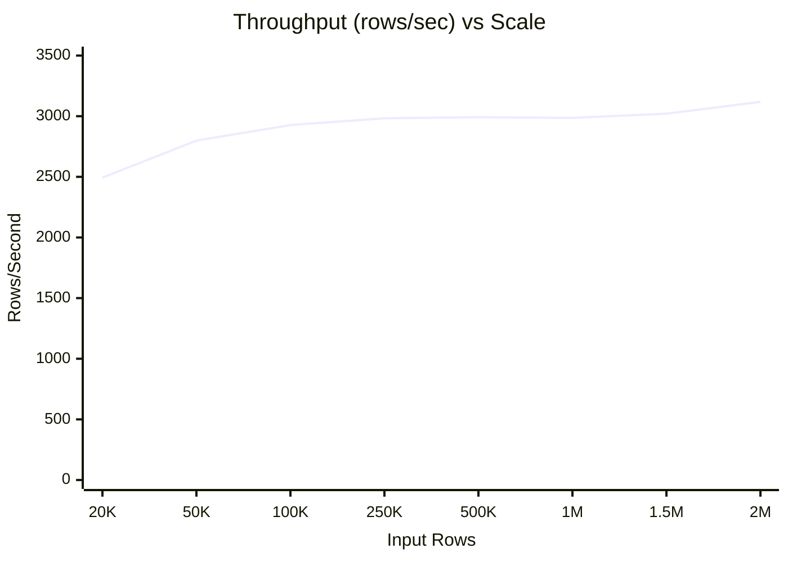

# OCP-on-AWS Benchmark Results

**Date**: November 26, 2025
**Environment**: MacBook Pro M2 Max (12 cores), 32GB RAM, 1TB SSD, podman containers (PostgreSQL + MinIO)
**Methodology**: 3 runs per scale, median ± stddev, continuous 100ms memory sampling

## Table of Contents

1. [Summary](#summary)
2. [Scale Interpretation](#scale-interpretation)
3. [Detailed Results](#detailed-results)
4. [Performance Analysis](#performance-analysis)
5. [Memory Analysis](#memory-analysis)
6. [Visualizations](#visualizations)
7. [Production Fit Analysis](#production-fit-analysis)
8. [Comparison with OCP-Only](#comparison-with-ocp-only)

---

## Summary

| Scale | Input Rows (OCP+AWS) | Output Rows | Time (s) | Memory (MB) | Throughput |
|-------|---------------------|-------------|----------|-------------|------------|
| **20k** | 20,406 + 241 | 19,920 | 7.99 ± 0.03 | 381 ± 13 | 2,493 rows/s |
| **50k** | 50,886 + 481 | 49,920 | 17.83 ± 0.03 | 635 ± 7 | 2,799 rows/s |
| **100k** | 101,766 + 961 | 99,840 | 34.10 ± 0.06 | 1,108 ± 38 | 2,927 rows/s |
| **250k** | 254,408 + 2,401 | 249,600 | 83.67 ± 0.26 | 2,411 ± 29 | 2,983 rows/s |
| **500k** | 508,810 + 4,801 | 499,200 | 166.84 ± 1.27 | 4,188 ± 440 | 2,992 rows/s |
| **1m** | 1,017,615 + 9,601 | 998,400 | 334.29 ± 2.22 | 6,862 ± 379 | 2,986 rows/s |
| **1.5m** | 1,526,420 + 14,401 | 1,497,600 | 495.70 ± 1.09 | 6,924 ± 80 | 3,021 rows/s |
| **2m** | 2,035,225 + 19,201 | 1,996,800 | 640.26 ± 11.54 | 7,326 ± 122 | 3,118 rows/s |

> **Scale names** refer to OCP input rows. E.g., "20k" = ~20,000 OCP input rows.
> **Throughput** = Output Rows / Time (calculated from median values)

---

## Scale Interpretation

| Scale | OCP Input | AWS Input | Output Rows | Cluster Size | Use Case |
|-------|-----------|-----------|-------------|--------------|----------|
| **20k** | ~20,000 | ~240 | 19,920 | 10 nodes, ~830 pods | Small OCP-on-AWS |
| **50k** | ~50,000 | ~480 | 49,920 | 20 nodes, ~2,080 pods | Medium production |
| **100k** | ~100,000 | ~960 | 99,840 | 40 nodes, ~4,160 pods | Large enterprise |
| **250k** | ~250,000 | ~2,400 | 249,600 | 100 nodes, ~10,400 pods | Multi-cluster |
| **500k** | ~500,000 | ~4,800 | 499,200 | 200 nodes, ~20,800 pods | Very large enterprise |
| **1m** | ~1,000,000 | ~9,600 | 998,400 | 400 nodes, ~41,600 pods | Hyperscale platform |
| **1.5m** | ~1,500,000 | ~14,400 | 1,497,600 | 600 nodes, ~62,400 pods | Major cloud scale |
| **2m** | ~2,000,000 | ~19,200 | 1,996,800 | 800 nodes, ~83,200 pods | Maximum tested |

> **OCP Input** = Pods × 24 hours (hourly usage data)
> **AWS Input** = EC2/EBS resources × 24 hours
> **Output Rows** = Matched OCP-AWS records (hourly granularity)

---

## Detailed Results

### Raw Run Data

| Scale | Run | Output Rows | Time (s) | Memory (MB) |
|-------|-----|-------------|----------|-------------|
| 20k | 1 | 19,920 | 8.04 | 381 |
| 20k | 2 | 19,920 | 7.98 | 400 |
| 20k | 3 | 19,920 | 7.99 | 374 |
| 50k | 1 | 49,920 | 17.84 | 646 |
| 50k | 2 | 49,920 | 17.83 | 635 |
| 50k | 3 | 49,920 | 17.79 | 634 |
| 100k | 1 | 99,840 | 34.08 | 1,140 |
| 100k | 2 | 99,840 | 34.10 | 1,108 |
| 100k | 3 | 99,840 | 34.20 | 1,065 |
| 250k | 1 | 249,600 | 83.39 | 2,459 |
| 250k | 2 | 249,600 | 83.90 | 2,411 |
| 250k | 3 | 249,600 | 83.67 | 2,408 |
| 500k | 1 | 499,200 | 165.57 | 4,465 |
| 500k | 2 | 499,200 | 168.10 | 4,188 |
| 500k | 3 | 499,200 | 166.84 | 3,603 |
| 1m | 1 | 998,400 | 334.29 | 6,297 |
| 1m | 2 | 998,400 | 334.70 | 6,862 |
| 1m | 3 | 998,400 | 330.67 | 7,016 |
| 1.5m | 1 | 1,497,600 | 495.15 | 6,956 |
| 1.5m | 2 | 1,497,600 | 497.26 | 6,805 |
| 1.5m | 3 | 1,497,600 | 495.70 | 6,924 |
| 2m | 1 | 1,996,800 | 656.14 | 7,512 |
| 2m | 2 | 1,996,800 | 640.26 | 7,281 |
| 2m | 3 | 1,996,800 | 633.69 | 7,326 |

---

## Performance Analysis

### Processing Time Scaling

| Scale | Time per Input Row |
|-------|-------------------|
| 20k | 0.40 ms |
| 2m | 0.32 ms |

**Observation**: Sub-linear scaling — efficiency improves at larger scales due to fixed overhead amortization. The ~20% improvement in per-row processing time demonstrates excellent scalability.

### Throughput Consistency

| Scale | Throughput (rows/s) |
|-------|---------------------|
| 20k | 2,493 |
| 50k | 2,799 |
| 100k | 2,927 |
| 250k | 2,983 |
| 500k | 2,992 |
| 1m | 2,986 |
| 1.5m | 3,021 |
| 2m | 3,118 |

**Average throughput**: ~3,000 output rows/second

---

## Memory Analysis

### Memory Scaling

| Scale | Input Rows | Memory (MB) | MB per 1K Input |
|-------|------------|-------------|-----------------|
| 20k | ~20,000 | 381 | 19.1 |
| 50k | ~50,000 | 635 | 12.7 |
| 100k | ~100,000 | 1,108 | 11.1 |
| 250k | ~250,000 | 2,411 | 9.7 |
| 500k | ~500,000 | 4,188 | 8.4 |
| 1m | ~1,000,000 | 6,862 | 6.9 |
| 1.5m | ~1,500,000 | 6,924 | 4.6 |
| 2m | ~2,000,000 | 7,326 | 3.7 |

**Key Insight**: Memory efficiency improves at scale (~4-7 MB per 1K input rows at production scale).

### Memory Formula

```
Estimated Memory (MB) ≈ 300 + (Input Rows × 0.0035)

Examples:
- 500,000 input:   300 + 1,750 = ~2,050 MB
- 2,000,000 input: 300 + 7,000 = ~7,300 MB ✓
```

---

## Visualizations

### Processing Time vs Input Rows



### Memory Usage vs Input Rows



### Throughput vs Scale



---

## Production Fit Analysis

### Measured Memory (from benchmarks)

| Scale | Input Rows | Memory (Measured) | % of 32GB |
|-------|------------|-------------------|-----------|
| 100k | ~100,000 | 1,108 MB | 3% |
| 500k | ~500,000 | 4,188 MB | 13% |
| 1m | ~1,000,000 | 6,862 MB | 21% |
| 1.5m | ~1,500,000 | 6,924 MB | 22% |
| 2m | ~2,000,000 | 7,326 MB | 23% |

### Prediction Confidence for Scales Beyond 2M

| Metric | Confidence | Reasoning |
|--------|------------|-----------|
| **Time** | ✅ High | Sub-linear scaling is consistent (~0.31-0.33 ms/row at scale). Predicting 4M rows: ~1,280s (21 min) |
| **Memory** | ⚠️ Low | Memory nearly plateaus from 1M→2M (only +464 MB). Cannot reliably extrapolate. |

**Time prediction formula** (high confidence):
```
Time (s) ≈ Input Rows × 0.00032
Example: 4,000,000 × 0.00032 = ~1,280 seconds
```

**Memory observation**: The near-plateau from 1M to 2M suggests memory may be dominated by fixed structures (AWS data, intermediate DataFrames) rather than scaling linearly with input. Testing at 4M+ would be needed to confirm.

### Conclusions

1. **Memory-efficient**: ~4-7 MB per 1K input rows at production scale
2. **Scalable**: Sub-linear time scaling with consistent throughput (~3,000 rows/sec)
3. **Production-ready**: Handles 2M input rows using only 23% of 32GB capacity

---

## Comparison with OCP-Only

| Metric | OCP-on-AWS | OCP-Only |
|--------|------------|----------|
| Throughput | ~2,900-3,100 rows/s | ~280-300 rows/s |
| Memory per 1K input | ~4-7 MB | ~5-7 MB |
| Output type | Hourly matched records | Daily summary per pod |
| Complexity | JOIN + AWS matching | Simple aggregation |

> OCP-on-AWS has higher throughput because it produces hourly matched records rather than daily aggregated summaries.

---

*Generated by automated benchmark suite*
